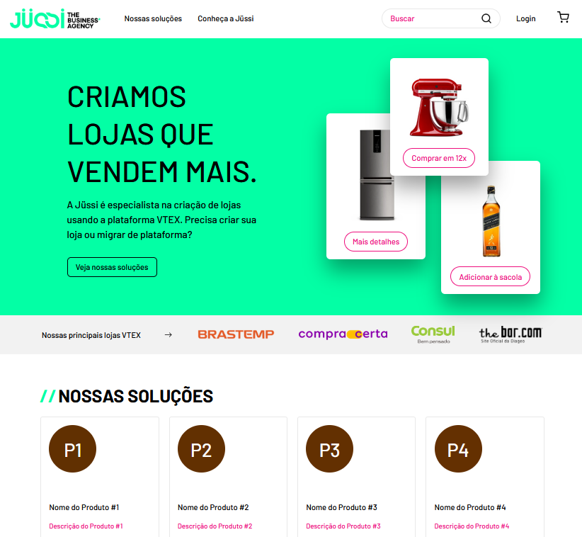

<h1 align="center">
  Jüssi App
</h1>
<h1 align="center">
    
</h1>

<br>

## 💻 Project

[Jüssi App](https://jussi-app.vercel.app/) is a landing page with search bar, that get data from Anime API using Axios, React Hooks and Debouncing.

## 🧪 Technologies

This project was made using the following Technologies:

- [NextJS](https://nextjs.org)
- [TypeScript](https://www.typescriptlang.org)
- [Framer-Motion](https://www.framer.com/motion)
- [Axios](https://github.com/axios/axios)

## 🪐 Running

To run the application...

```bash
# Clone the repository

$ git clone https://github.com/seufernandez/jussi-app.git


# Install all dependencies
$ yarn
```

App will be available on port: http://localhost:3000.

---

Made with 🧡 by Gabriel Fernandes 👋 [Join our community!](https://ahub.tech/discord)
